  

 

<h1 align="center">
  Welcome, I'm Erick Pérez  
  
</h1>

  Soy un desarrollador backend en formación de 19 años, apasionado por la gestión de proyectos de software y por crear aplicaciones eficientes, escalables y bien estructuradas.  
  Me motiva comprender todo el ciclo del desarrollo: desde la toma de requerimientos y la planeación, hasta la implementación y la documentación técnica.

 
  <!-- YouTube -->
  

  <!-- GitHub Followers -->
  

  <!-- Profile Views -->
  

---

## 🚀 Lo que estoy aprendiendo

- **Laravel 10.x (monolito con Blade):** Profundizando en el desarrollo backend, la organización de controladores, el uso de seeders, la gestión de autenticación y roles, y la aplicación de buenas prácticas para mantener el código limpio y mantenible.  
- **JavaScript:** Fortaleciendo la lógica, la manipulación del DOM y la conexión con APIs para mejorar la interacción entre frontend y backend, buscando interfaces más dinámicas y fluidas.  
- **Docker:** Configurando entornos de desarrollo estables y replicables, para que los proyectos sean fáciles de desplegar y de compartir entre equipos.  
- **Arquitecturas de software:** Explorando patrones y principios como MVC, modularidad y separación de responsabilidades, con el objetivo de construir sistemas más escalables y fáciles de mantener.  
- **Diseño de bases de datos:** Modelando estructuras relacionales, definiendo relaciones y claves foráneas para garantizar la integridad y coherencia de la información.  
- **Git y GitHub:** Refinando el uso de ramas (feature, develop, main), revisiones de código y estrategias de merge en entornos colaborativos.  
- **Gestión técnica:** Aplicando metodologías ágiles, control de versiones y comunicación técnica para que la planificación y el desarrollo sean más organizados y predecibles.  
- **Documentación y diseño:** Uso herramientas como **PlantText** y **ChartDB** para diagramar estructuras de software, y **Figma** para maquetar y prototipar interfaces alineadas con los objetivos del proyecto.

> 💡 *Me gusta integrar lo técnico con la gestión: no solo programar, sino entender el “por qué” de cada decisión.*

---

## 🛠️ Herramientas y tecnologías que manejo

- **Lenguajes:** PHP, JavaScript, HTML, CSS.  
- **Frameworks y librerías:** Laravel, TailwindCSS, Flowbite.  
- **Bases de datos:** MySQL, PostgreSQL.  
- **Entorno de desarrollo:** Laragon y Docker.  
- **IDE principal:** Visual Studio Code.  
- **Gestores de bases de datos:** DBeaver y phpMyAdmin.  
- **Control de versiones:** Git y GitHub, trabajando con flujos de ramas como feature, develop y main.  
- **Diseño y documentación:** Figma para prototipado de interfaces; PlantText y ChartDB para diagramas y modelado de sistemas.  
- **Gestión de proyectos:** Trello y Taiga para organización de tareas, seguimiento de avances y control de entregas.

---

## 📚 Experiencia actual

Actualmente trabajo en una **Fábrica de Software**, donde participo en el desarrollo de sistemas internos para una institución de educación superior.  
Dentro de mis responsabilidades se encuentran:

- Estructurar y desarrollar módulos backend.  
- Colaborar en el análisis y levantamiento de requerimientos.  
- Apoyar la definición de flujos y reglas de negocio.  
- Mantener y mejorar la documentación técnica de los proyectos.  

Este rol me ha permitido fortalecer mis habilidades técnicas, entender mejor cómo se construyen soluciones reales en un entorno profesional, potenciar el trabajo en equipo y consolidar un enfoque más organizado y estratégico al momento de desarrollar software.

Además, complemento esta experiencia con proyectos personales y formación académica, donde pongo en práctica lo aprendido, mejoro mi lógica y exploro nuevas tecnologías que amplían mi visión como desarrollador.

---

## 🌱 Mi objetivo profesional

Seguir consolidándome como **desarrollador backend** con un enfoque claro en **gestión de proyectos técnicos**.  
Quiero aplicar buenas prácticas, una planeación consciente y un trabajo en equipo sólido para construir soluciones que:

- Sean técnicamente robustas y escalables.  
- Resuelvan problemas reales y aporten valor a las organizaciones.  
- Faciliten la vida de quienes las usan y de quienes las mantienen.  

> 💬 *“Un proyecto bien gestionado no solo se entrega a tiempo, también deja un equipo más fuerte detrás.”*

---

## 📫 Conéctate conmigo

- **Correo electrónico:** [ericksperezc@gmail.com](mailto:ericksperezc@gmail.com)  
- **Instagram:** [@Erickperez_8](https://www.instagram.com/erickperez_8/)  
- **YouTube:** [ErickPerez_8](https://www.youtube.com/@ErickPerez_8)

---

## 📈 Metrics Dashboard

  
  <!-- Imagen generada por GitHub Actions -->
  

    

  <!-- Pie de página -->
  
    <i>Desarrollado con ❤️</i>
  

